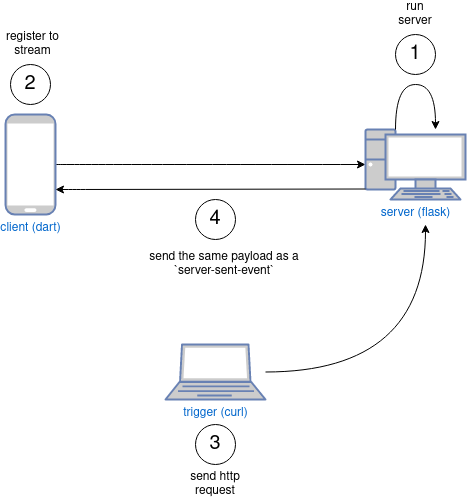

# sse-prototype
local **client** (dart with eventsource) / **server** (python with flask-sse) implementation to send bidirectional server-sent-event from server to client.



## RUN

### run http-server
```sh
cd server/flask
python3 run.py
```

### run client
```sh
cd client/mysse-dart
dart run
```

### send http-request to server
*server will send this payload as an sse event through the client*

#### curl (non-authenticated)
```sh
#!/bin/bash
curl -X GET \
-H "Content-Type: application/json" \
-d '{"foo": "bar"}' \
http://127.0.0.1:5001/hello
```

#### python (non-authenticated)
```sh
url = "http://127.0.0.1:5001/hello"
data = {"key": "value"}
r = requests.post(url, json=data)  
print("status_code: {}".format(r.status_code)
print("response-text: {}".format(r.json()))
```

#### python (authenticated)
```sh
# get jwt token
url = "http://127.0.0.1:5001/rest/login"
data = {"username": "kivanc", "password": "1234"}
r = requests.post(url, json=data)
output = r.json()
token = output['access_token']

# now send through auth_hello
url = "http://127.0.0.1:5001/auth_hello"
data = {"key": "value"}
headers = {'Authorization': 'Bearer {}'.format(token)}
r = requests.post(url, json=data, headers=headers)

print("status_code: {}".format(r.status_code)
print("response-text: {}".format(r.json()))
```

## INSTALL

### for server side
*install redis server*
```sh
sudo apt-get install redis-server
```

*install flask and flask-sse*
```sh
sudo apt-get install python3-flask
sudo pip3 install flask-sse
```

### for client side
*install dart*
```sh
https://dart.dev/get-dart
```

*install dependencies*
```sh
cd mysse
dart pub get
```

## SOURCES

```sh
https://pypi.org/project/Flask-SSE/
```

```sh
https://github.com/featurehub-io/featurehub/tree/main/sdks/dart/dart-eventsource
```

```sh
https://maxhalford.github.io/blog/flask-sse-no-deps/
```
